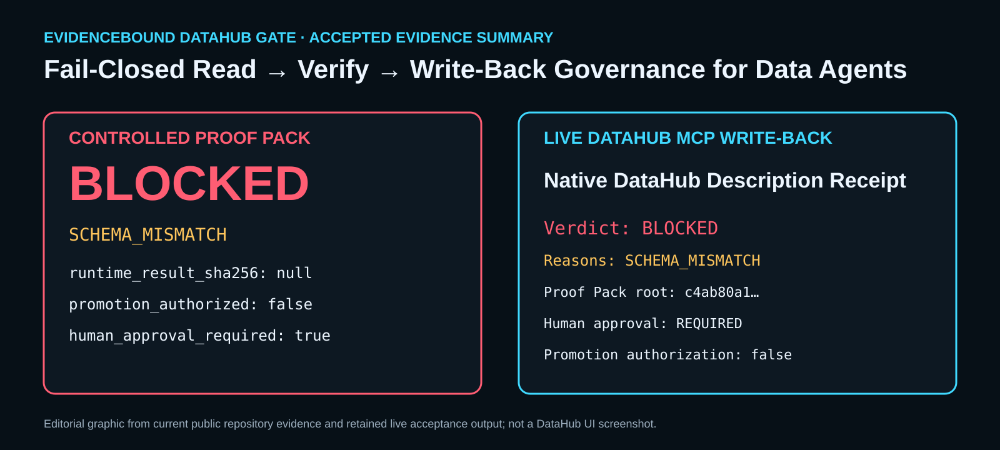

# EvidenceBound DataHub Gate



**Fail-Closed Read → Verify → Write-Back Governance for Data Agents.**

This repository is the newly authored DataHub hackathon vertical slice of the broader EvidenceBound design. It is intentionally independent of SignalReview production, private enterprise workers, customer code, billing, authentication, and proprietary sports logic.

## How judges can verify the evidence

The fastest controlled path does not require a running DataHub instance:

```bash
git clone https://github.com/moneyparking/evidencebound-datahub-gate.git
cd evidencebound-datahub-gate
make test-repro
```

`make test-repro` creates a local virtual environment, installs the development dependencies, runs the deterministic validation suite, regenerates the controlled `VERIFIED` and stale-schema `BLOCKED` Proof Packs, and reproduces both packs.

Expected terminal states include:

```text
VERIFIED
BLOCKED: SCHEMA_MISMATCH
REPRODUCED
ARTIFACT_TAMPERING_DETECTED  # required by the retained mutation test
SIGNATURE_VALID              # retained Ed25519-sealed packs
```

To reproduce only the retained packs after installation:

```bash
make verify-packs
```

To verify the retained detached Ed25519 seals against the repository-published public key:

```bash
evidencebound-datahub verify-seal \
  evidence/controlled-verified \
  --public-key docs/judge/keys/evidencebound-datahub-hackathon-public.pem

evidencebound-datahub verify-seal \
  evidence/controlled-blocked \
  --public-key docs/judge/keys/evidencebound-datahub-hackathon-public.pem
```

Expected for both packs:

```text
SIGNATURE_VALID
trusted_public_key_matched: true
PINNED_KEY_MATCHED
```

To run the same process from a fresh clone in a temporary directory and emit an independent report:

```bash
make independent-repro
```

To inspect the static public judge journey locally:

```bash
make serve-judge
# open http://localhost:8000
```

Public Judge Explorer:

```text
https://moneyparking.github.io/evidencebound-datahub-gate/
```

The static judge journey is an editorial proof explorer. It does not execute DataHub, represent live DataHub UI, create new acceptance evidence, or authorize deployment. No fixed clean-install duration is claimed because dependency download time varies.

## Reproduce the complete DataHub MCP loop

Prerequisites: Linux/WSL, Docker, Python 3.11+, network access for the first install, and sufficient Docker memory.

```bash
git clone https://github.com/moneyparking/evidencebound-datahub-gate.git
cd evidencebound-datahub-gate

python3 -m venv .venv
source .venv/bin/activate

./scripts/run-local-datahub-smoke.sh
```

The first run downloads and starts DataHub containers, so completion time depends on network speed and available system resources. No fixed clean-install duration is claimed.

## The problem

Agents can read metadata and still take unsafe actions when generated code is bound to a stale schema, incomplete lineage, or unsupported claims. A successful tool call is not proof that the intended action is safe.

## What it does

**Read Context → Restricted AST Gate → Tamper-Evident Proof Pack → Native DataHub Write-Back**

```text
DataHub MCP
  ├─ dataset identity
  ├─ schema fields
  └─ bounded one-hop lineage edge
          ↓
EvidenceBound deterministic gate
  ├─ dataset identity binding
  ├─ schema + lineage digests
  ├─ Restricted AST Policy
  ├─ Fail-Closed Bounded Interpreter
  ├─ claim-to-evidence binding
  └─ VERIFIED / BLOCKED receipt
          ↓
Tamper-Evident Content-Addressed Proof Pack
          ↓
Native DataHub Description Receipt
          ↓
Mandatory Human Review
```

Two paths are mandatory:

1. **VERIFIED** — current schema and the bounded lineage evidence match the candidate contract.
2. **BLOCKED** — a stale schema digest fails closed before runtime interpretation.

Both outcomes are appended to the same DataHub dataset through the official native `update_description` MCP mutation. The write-back is metadata evidence, not production approval, transaction authorization, or permission to deploy.

## Read-only verification and governed write-back

Read-only and write-back executions are intentionally distinct evidence classes.

- A read-only recording can prove MCP read, the current-context `VERIFIED` path, the stale-schema `BLOCKED` path, and fresh Proof Pack generation without mutating DataHub metadata.
- Native write-back is executed only in the explicit live acceptance path and appends evidence through the official `update_description` MCP mutation.
- The write-back receipt records `promotion_authorized=false`; Mandatory Human Review remains outside automation.

This separation is a fail-closed operating policy, not a claim that the read-only recording performed write-back.

## Why native description write-back

The hackathon criterion rewards contributing knowledge back to the graph. `update_description` is an official DataHub MCP mutation, visible in DataHub OSS, and requires no custom schema registration. This project does not claim a custom DataHub badge or aspect.

## Quick controlled proof without Docker

```bash
python3 -m venv .venv
source .venv/bin/activate
pip install -e '.[dev]'
./scripts/validate.sh
```

This generates two controlled Proof Packs under `evidence/` and reproduces both.

You can also reproduce the retained packs directly:

```bash
evidencebound-datahub verify-pack evidence/controlled-verified
evidencebound-datahub verify-pack evidence/controlled-blocked
```

## Live local DataHub acceptance

The live script:

1. installs DataHub and the official DataHub MCP server;
2. runs `datahub docker quickstart`;
3. loads the Apache-2.0 showcase ecommerce datapack;
4. discovers a dataset through MCP;
5. reads the dataset entity, schema, and a bounded one-hop lineage edge through DataHub MCP;
6. runs the current-context `VERIFIED` candidate and stale-schema `BLOCKED` candidate;
7. appends both Native DataHub Description Receipts through MCP `update_description`;
8. reproduces each Proof Pack;
9. prints `DATAHUB_MCP_READ_WRITE_ACCEPTANCE=PASS` only when every required gate passes.

The accepted live dataset was:

```text
urn:li:dataset:(urn:li:dataPlatform:dbt,b2fd91.ORDER_ENTRY_DB.analytics.order_history,PROD)
```

The read is deliberately bounded to one hop and at most five results. The adapter checks upstream first and skips the opposite direction after a visible lineage edge is found. Missing lineage still blocks verification.

### Stop condition

If the live smoke cannot prove all four states, preserve the logs and fail closed:

- MCP read: PASS
- current-context path: VERIFIED
- stale-schema path: BLOCKED
- MCP description write-back: PASS

A controlled fixture is never presented as live DataHub acceptance.

## Proof Pack

Each path contains:

```text
candidate.json
datahub-context.json
gate-receipt.json
mcp-read.json
mcp-write.json
manifest.json
SHA256SUMS
ed25519-seal.json  # optional contract; present in the retained controlled packs
```

`evidence_root_sha256` deterministically binds the candidate, DataHub context, receipt, and MCP read evidence. `manifest_body_sha256` additionally binds the MCP write result.

Reproduction rejects modified artifacts, non-canonical JSON, symlinks, missing files, and unexpected files. The retained test mutates `gate-receipt.json` by one byte and requires `ARTIFACT_TAMPERING_DETECTED`.

The Proof Pack remains tamper-evident and content-addressed through SHA-256. When `ed25519-seal.json` is present, a separate verification step validates the detached Ed25519 signature over the verified manifest subject.

### Retained Ed25519 release key

The retained controlled `VERIFIED` and `BLOCKED` packs are signed with the same owner-controlled key:

```text
key_id: evidencebound-datahub-hackathon-2026
public_key_sha256: fdf31b458136d39b3c22fe041e9ae7c986365c40275383d09e8a38ae81f0680d
public_key: docs/judge/keys/evidencebound-datahub-hackathon-public.pem
```

The private key is not stored in the repository. A valid signature proves possession of the matching private key. The repository-published public key makes verification reproducible, but independent signer identity still requires comparison of the fingerprint through a separately trusted channel. See `docs/judge/SECURITY_AND_TRUST.md`.

## How it was built

Built with the official DataHub MCP server via FastMCP, the DataHub SDK, a restricted AST policy, a bounded no-exec interpreter, a Python verification core, and optional detached Ed25519 attestation. The public repository is Apache-2.0 licensed.

Validation uses pytest, Ruff, Mypy, and GitHub Actions.

## Claim boundary

`VERIFIED` means only that the exact candidate matched the observed DataHub context, passed the Restricted AST Policy, executed in the Fail-Closed Bounded Interpreter, and bound every material claim to schema or lineage evidence.

It does **not** mean production approval, production authorization, data truth, regulatory certification, model accuracy, financial safety, customer acceptance, or permission to deploy. `promotion_authorized` is always `false`; Mandatory Human Review always remains required.

No LLM integration is claimed in this repository.

## Hackathon positioning

- Track: **Agents That Do Real Work**
- DataHub technologies: DataHub OSS + official DataHub MCP server
- Judge-visible loop: Read Context → Restricted AST Gate → Tamper-Evident Proof Pack → Native DataHub Write-Back
- Public repository and deterministic GitHub Actions gates
- Submission disclosure: the EvidenceBound concept and earlier private/open-core work predate this hackathon; this DataHub adapter, bounded demo runtime, MCP workflow, and shared evidence pack were newly authored during the submission period.

## Submission media integrity — V12

The recommended Devpost/YouTube master is:

```text
EvidenceBound_DataHub_Hackathon_FINAL_MASTER_V12_JUDGE_CAPTIONED.mp4
SHA-256: e51fbd9d9ddf69d87d7754be05f80f765cf05f768d63aff21c854c5815bd2a9a
Duration: 169.813000 seconds
Resolution: 1920×1080
Frame rate: 30 fps
Release source commit: 9f39bcf2498a05a47dd7b0a82049e95893770642
```

The master contains burned English narration captions; do not overlay a second subtitle track. V12 shows the redesigned Judge Explorer, detached Ed25519 verification for the retained controlled `VERIFIED` and `BLOCKED` packs, the repository-published key fingerprint, release-source identity, successful deterministic and independent-reproduction gates, successful Pages deployment, and the Mandatory Human Review boundary.

The retained controlled sealed packs are distinct from the accepted live DataHub MCP dataset and native description write-back evidence. V12 does not claim that the separate live acceptance packs were signed.

Full V12 media evidence, the clean alternative, hashes, audio QA, release acceptance, and publication gates are recorded in:

- `submission/datahub-v12-video-proof.json`;
- `submission/DATAHUB_DEVPOST_MEDIA_V12.md`;
- `docs/media/VIDEO_MASTER.md`.

Historical V7.1 media records remain in `submission/` as audit history and are not the recommended final submission master.

## Final Devpost submission

The canonical final second-page copy, Built With tags, public links, gallery order, and V12 video identity are recorded in `DEVPOST_SUBMISSION_V12.md`.

## Grant synchronization

`grant-sync/claim-map.json` is the single claim boundary for Startup EDGE and Microsoft for Startups materials. It distinguishes controlled evidence, live MCP acceptance, and prohibited claims. A hackathon demo alone does not establish TRL level, funding, certification, production readiness, or customer acceptance.

## License

Apache License 2.0 applies to this published repository. It does not automatically relicense all transitive dependencies. See `LICENSE` and dependency licenses.
